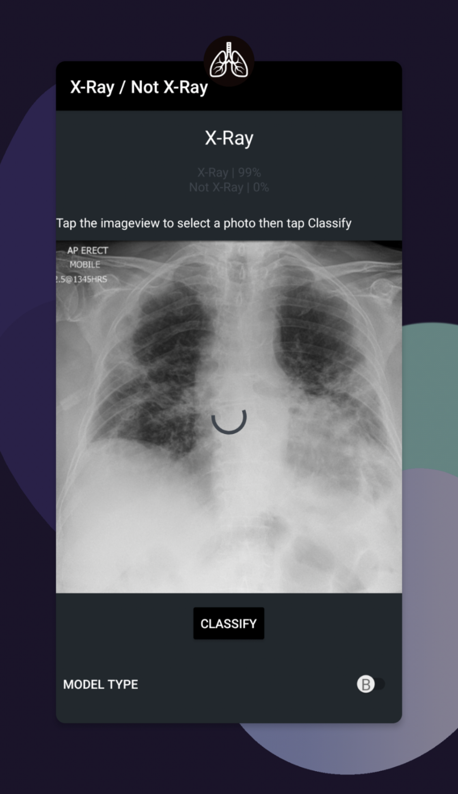
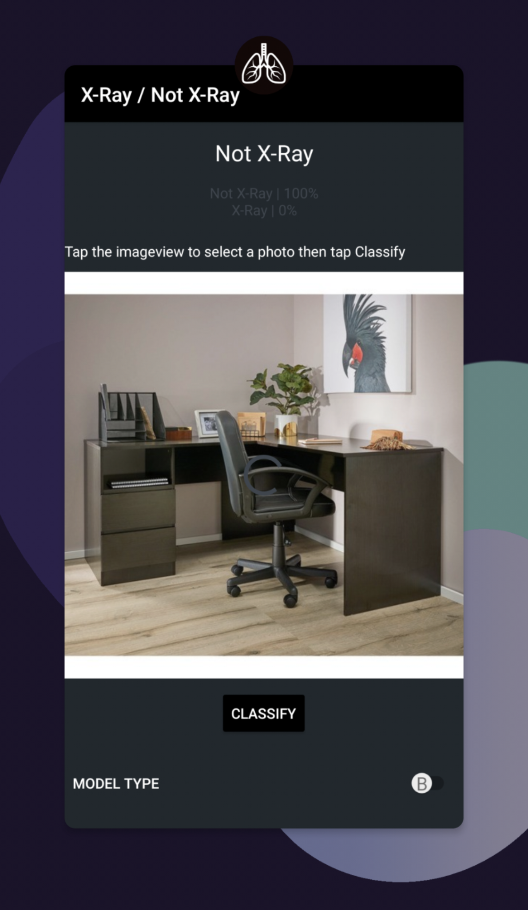

# Chest X-Ray / not Chest X-Ray Model for Input Validation purposes
## Simple model and android application to determine whether an image is either a Chest X-Ray or Not

  

A (poc) android application to classify images into category of Chest X-Rays or not Chest X-Rays.

__Use case intended for when a user provides an image and image input validation is required before processing the image as a Chest X-Ray.__

  
  

API 26 - Oreo

# Trained Models

The trained models are TFlite models trained from 500 Chest X-Ray images and 1000 normal random images (500 grayscale and 500 color).
The trained models can be obtained from the assets folder.

|  Type  | Trained on Resolution |  Size |       Model      |
|:------:|:---------------------:|:-----:|:----------------:|
| Float  |        500x500        |  40M  | [model_unquant.tflite](/app/src/main/assets/model_unquant.tflite)|
| Quant  |        500x500        |  12M  | [model.tflite](/app/src/main/assets/model.tflite)|
